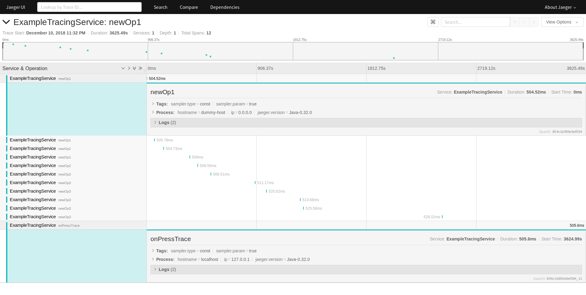

# Testing Jaeger tracing on Android

### Some implementation notes

- [The docs](https://github.com/jaegertracing/jaeger-client-java/blob/master/jaeger-core/README.md)
recommend you use `Tracer tracer = Configuration.fromEnv().getTracer();`
which makes little sense for Android as we don't control the ENV vars.

- Duplicate META-INF file errors start happening once you include jaegers dependencies.
[Fixed with an exclude like this](https://stackoverflow.com/questions/44342455/more-than-one-file-was-found-with-os-independent-path-meta-inf-license#47509465)

- `<uses-permission android:name="android.permission.INTERNET"/>` required of course.

- Initializing the tracer on the main thread causes a `android.os.NetworkOnMainThreadException` due to `InetAddress.getLocalHost()` being called for the `ip` and `hostname` tags.
Either set those manually or initialize off the main thread.

- Randomness quality of `io.jaegertracing.internal.utils.Utils.uniqueId` is extremely low. Causing spanId collisions.

- Logging support requires an additional package `slf4j-android`
such as `org.slf4j:slf4j-android:1.7.25` from jcenter.

### Randomness quality

Here's an example of me setting a breakpoint to see the Long produced by
`Java6CompatibleThreadLocalRandom.current().nextLong();`

It almost seems tied to uptime as the later ones are less likely to collide.

```
-9201949609202618220 x3
-8619592029950413405 x3
-2026341794611032000 x2
-6396153114935662112 x3
 3161358585497756669 -
-2332688683697357959 -

== restart application ==

-9201949609202618220 x3
-6396153114935662112 x3
-8619592029950413405 x3
-6662863254555043445 x2
 8227148315116627998 -
-3110453752544509859 -
-2446405553574246131 -

== restart application ==

-9201949609202618220 x3
-8619592029950413405 x3
-6662863254555043445 x2
-6396153114935662112 x3
-2026341794611032000 x2
 1338145981130179361 -
 5205072654012701703 -
```

This ends up combining spans that weren't actually related.


